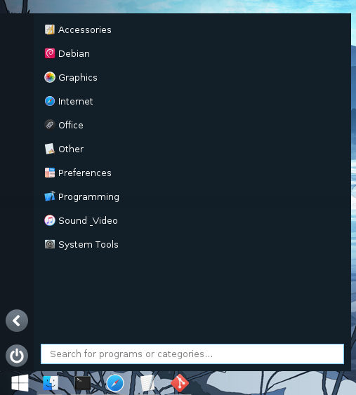

# Start Menu

Windows 10-like start menu for Linux.

## Requirements

* PyQt5
* pyxdg
* Dockbarx (if you want a start button for the dock)

## Installation

Run `./install.sh` with root permissions.

If you want to install for dockbarx, pass dockbarx as an argument.
